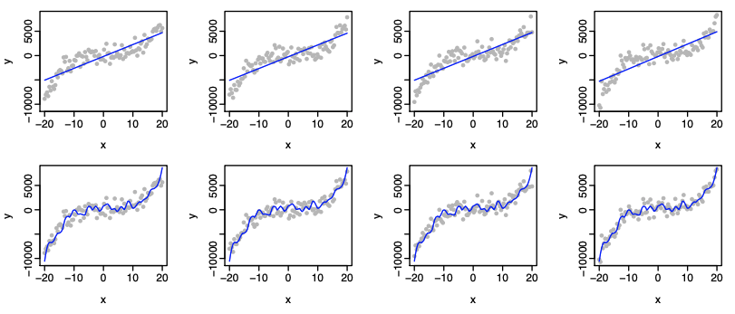
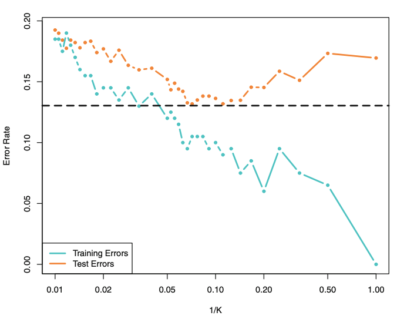

## Overview

For each of the following prompts, produce responses _with_ code in-line. While you are encouraged to stage and draft your problem set solutions using any files, code, and data you'd like within the private repo for the assignment, *only the final, rendered PDF with responses and code in-line will be graded.*

## Bias & Variance

1. (10 points) Consider the following eight plots based on model fits, assuming the data generating process, $$y = x^3 - 2x^2 + 1.5x + \epsilon.$$ Specifically, the figure shows two different fits of a model (one for each row) on each of the four samples (one for each column). So, e.g., column 1 shows two versions of a model fit to the same sample of 100 observations, which were drawn at random from the data generating process in the equation above. *Describe the difference between the two models in terms of complexity, bias, and variance. Responses should be at least a few sentences.*

2. (10 points) Building on the previous question and considering the following figure from ch. 2 of the ISL book, think about training and test error moving from a less flexible model towards more a more flexible model. Specifically, the figure is becoming more "flexible" as the number of neighbors, $k$, decreases, thereby picking up more local behavior. We haven't yet covered kNN or other supervised classifiers, but the logic of the figure should be apparent, where the level of flexibility of a model will directly influence training and testing error. *Explain why these two curves have the shapes they do. Responses should be at least a few sentences.*

3. (10 points) When the sample size, $n$, is very large, and the number of predictors, $p$, is small, would we expect the performance of a flexible model to be better or worse than an inflexible method? Justify your answer.

4. (10 points) When the number of predictors, $p$ is very large, and the sample size, $n$, is small, would we expect the performance of a flexible model to be better or worse than an inflexible method? Justify your answer.

5. (10 points) When the relationship between the predictors, $\mathbf{X}$, and response, $y$, is highly non-linear, would we expect the performance of a flexible model to be better or worse than an inflexible method? Justify your answer.

6. (10 points) Why can minimizing the training mean squared error (MSE) lead to overfitting? *Responses should be at least a few sentences.*

7. (10 points) Recall bootstrapping involves a process of drawing random samples of size $n$ through sampling *with* replacement. Create and plot two bootstrapped samples manually (i.e., *not using a function like `boot()`*). For reference, also plot the original data set to compare distributions. *Note:* When loading the data, you may simply drop the `NA`s, rather than impute, for ease. 

8. (5 points) Discuss the distributions from the previous question. Do they look mostly similar as is expected by sampling with replacement? Why or why not, do you think? *Respond with a few sentences.*

9. (15 points) The median for feelings toward Obama (`ftobama`) is 39.5. Using a package or any function/method you'd like, bootstrap the standard error of our statistic of interest (which is the median in this case) based on 1000 draws from the data. You might consider writing a simple helper function to speed along the bootstrapping process, but this is up to you of course. Then, construct the 95% confidence interval around your bootstrapped estimate. Report your results and offer a few points of discussion. *Respond with a few sentences.*

10. (10 points) How are bootstrapping and cross-validation approaches to resampling different? How are they similar? Why does any of this matter from both social science and computational modeling perspectives?
